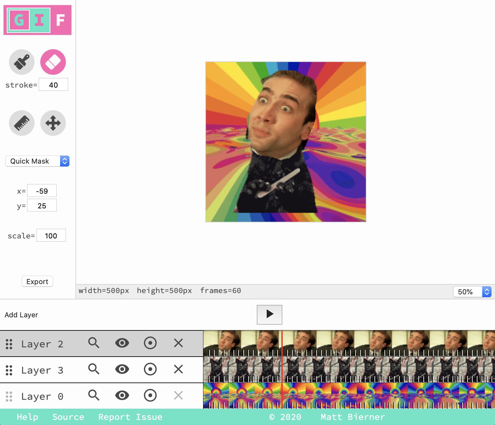
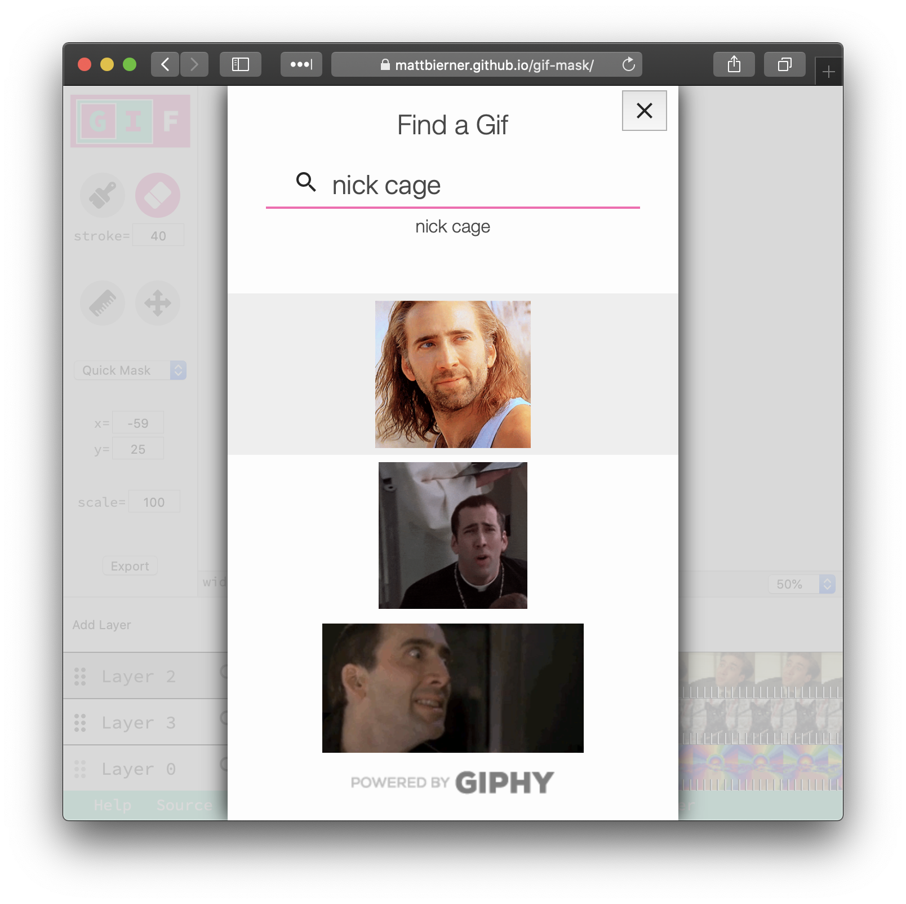
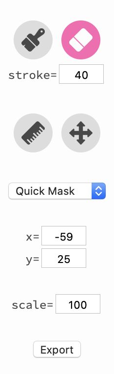
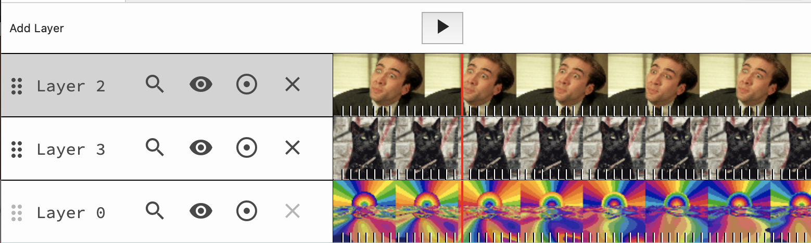
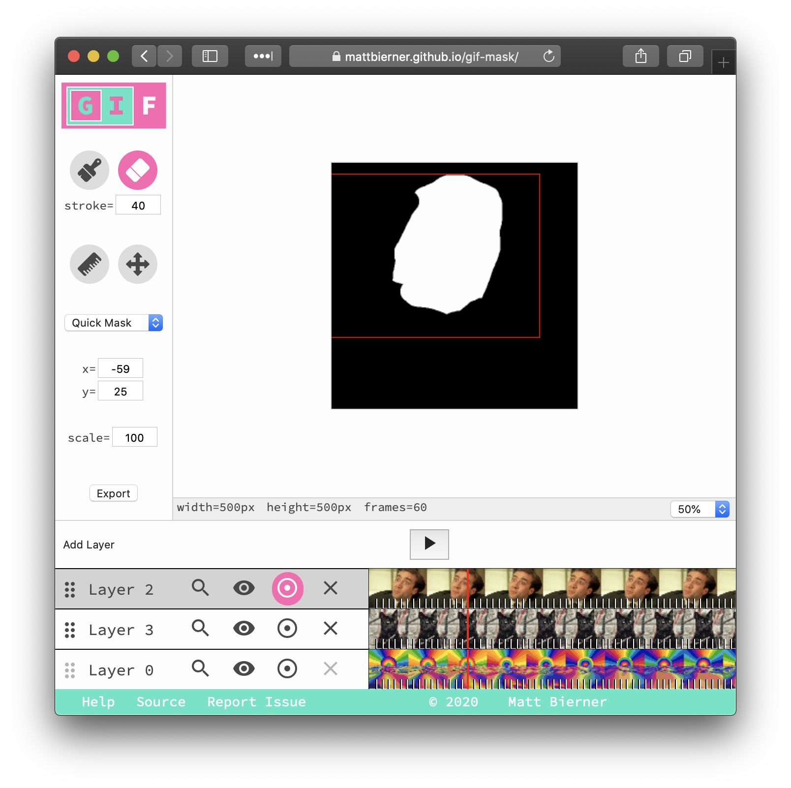

# Gif Mask

Web app for remixing gifs using [image masks](https://en.wikipedia.org/wiki/Mask_(computing)#Image_masks).


**Links**

- [Try it!][site]
- [Blog post][post]

## Usage

*Gif Mask* lets you composite multiple gifs using [image masks](https://en.wikipedia.org/wiki/Mask_(computing)#Image_masks). An image mask is a black and white image that defines which parts of each gif should be visible and which parts should be hidden.

Gif mask is not intended to be a photoshop replacement but to allow you to quickly remix gifs. Even if the results aren't great looking, it can still be fun to play around with.

### Basics



A *Gif Mask* file consists of two or more layers (gifs). These layers are displayed at the bottom of the screen.

The base layer (the bottommost layer) is the gif that you build on. This layer defines the resolution, frame rate, and duration of the resulting composite gif. This is also the only layer that can not be masked or edited.

You can add as many layers on top of the base layer as you wish. *Gif Mask* draws layers starting at the base layer and moving upwards. This means that upper layers are drawn on top of lower layers. Each layer's mask defines which portions of that layer are visible in the resulting gif.

## Loading a Gif

To get started, create a new layer and either drag and drop a gif from your computer to that layer's timeline or hit the search icon in the timeline to load a gif from [Giphy](https://giphy.com). 



All layers start fully masked (completely hidden). To reveal part of the gif, make sure the targeted layer is selected by clicking on it's name in the timeline, and then use the brush tool to paint the sections of the gif you wish to reveal.

### Tools

*Gif Mask* includes some basic tools for editing image masks and working with gifs. These are displayed on the left in the side bar:



- Brush (b) — Reveal part of a layer. The stroke size can be adjusted.
- Erase (e) — Hide part of a layer. The stroke size can be adjusted.
- Line (g) — Draw a line that defines which parts of the layer should be visible.
- Quick mask — Apply one of a few built-in masks to a layer (such as revealing or hiding the layer entirely.)
- Move (v) — Move the layer about on the canvas.
- Scale — Set the scale of the layer, as a percentage.

Additionally, there are a few controls in the timeline:



- Search — Find a new gif on Giphy. This replaces the layer's current gif.
- Show / Hide — Toggle the visibility of the layer.
- Show Mask — Show the layer's image mask. White == visible, black == hidden.
- Delete layer — Delete the layer.



### Persistence and Privacy

All data is stored client side. There are no server components.

The app saves the state of the document so you can close the window and return to perfect your gif later. However at the moment the app only supports working with a single gif at a time.

## Building

The site is mainly written in TypeScript using react. It is bundled using webpack and served using [Jekyll](https://jekyllrb.com)

To run the site:

```bash
$ npm install
$ npm run build
$ Jekyll serve 
```

The main scripts are under `src/`. The bundled JavaScript is output to `js/`

## Credits

### Gif Encoder
Gif encoder from [GifCap](https://github.com/joaomoreno/gifcap).

### Icons 

- [Material Icons](https://material.io/resources/icons/?style=baseline)

- Brush, Move -  <a href="https://www.flaticon.com/free-icon/paint-brush_483917" title="Those Icons">Those Icons</a> from <a href="https://www.flaticon.com/" title="Flaticon">www.flaticon.com</a>

- Eraser: Icons made by <a href="https://icon54.com/" title="Pixel perfect">Pixel perfect</a> from <a href="https://www.flaticon.com/" title="Flaticon">www.flaticon.com</a>

- Ruler <a href="https://www.flaticon.com/authors/freepik" title="Freepik">Freepik</a> from <a href="https://www.flaticon.com/" title="Flaticon"> www.flaticon.com</a>


[site]: https://mattbierner.github.io/gif-mask/
[post]: https://blog.mattbierner.com/gif-mask